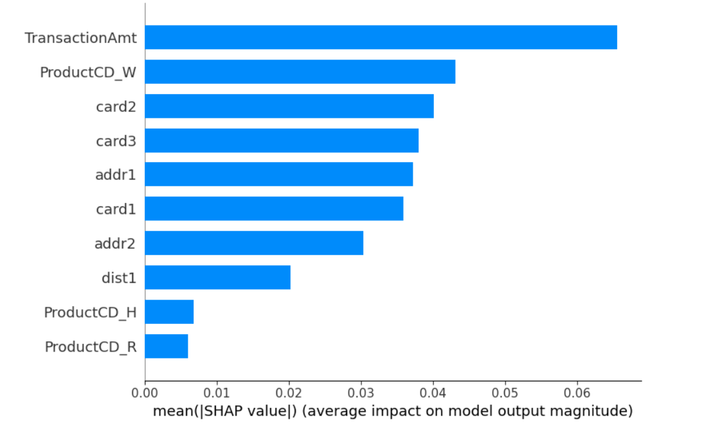
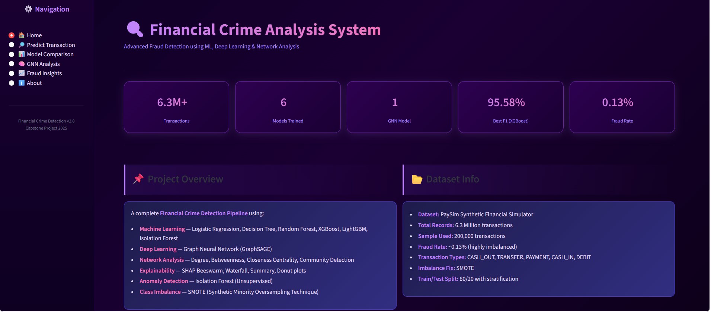
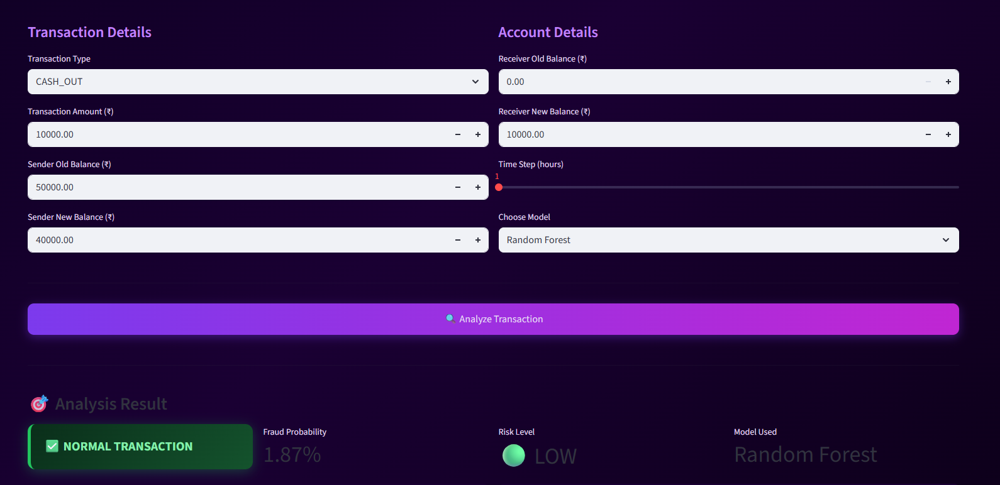
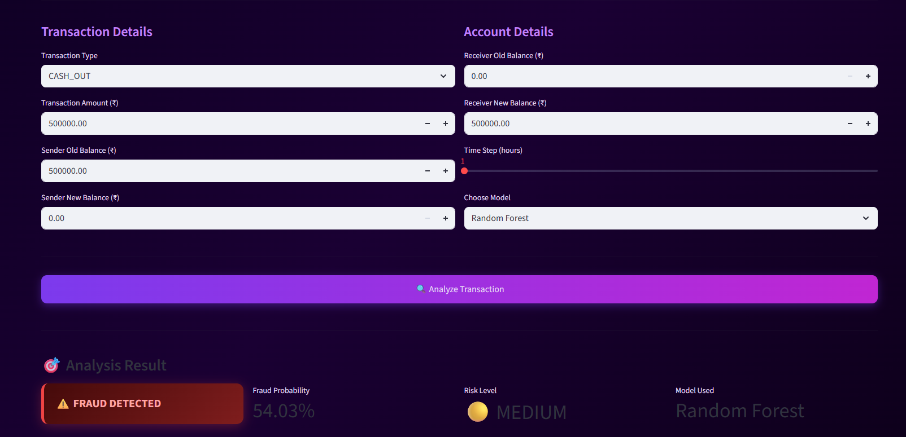
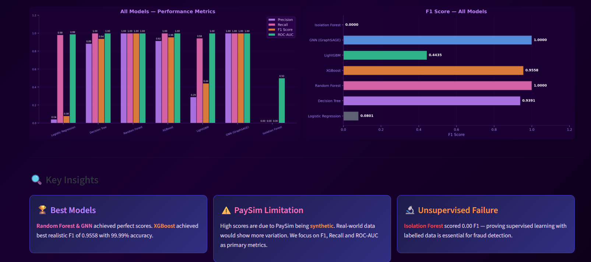
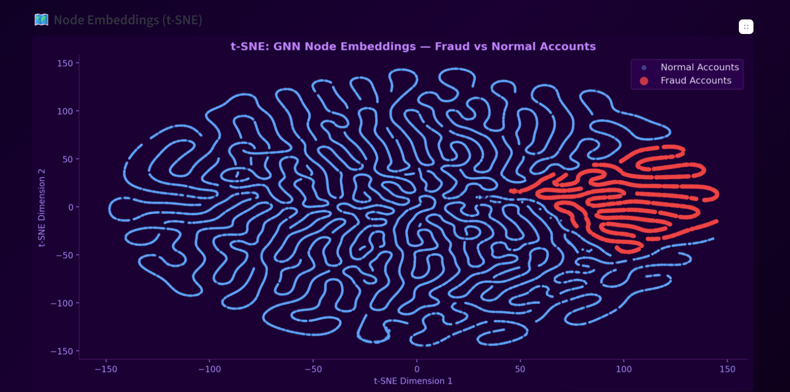
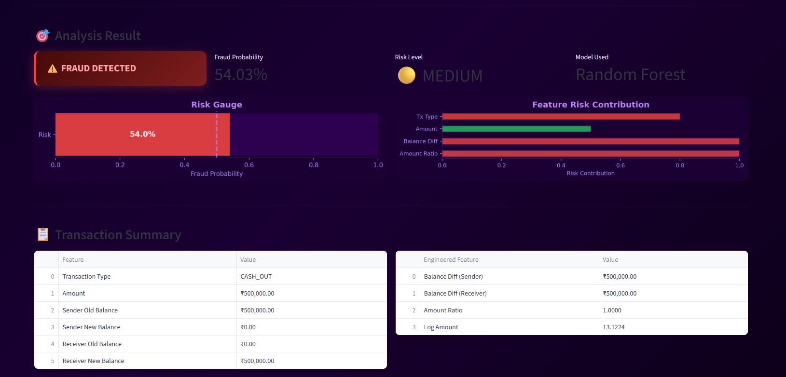

# FINGUARD – Financial Crime Network Detection

## Financial Crime Network Detection in Banking Transactions using Graph Analytics and Machine Learning

FINGUARD is an integrated financial fraud detection framework designed to identify fraudulent banking transactions and uncover coordinated fraud networks.

The project combines Machine Learning, Graph Neural Networks (GraphSAGE), Network Analysis, and Explainable AI (SHAP) to perform both transaction-level fraud detection and network-level fraud analysis.

The project also includes an interactive Streamlit dashboard for fraud prediction, model comparison, network visualization, GNN analysis, fraud insights, and explainability.

---

## Project Overview

Financial transaction fraud is a challenging problem because fraudulent transactions represent only a very small proportion of total transactions, while coordinated fraud activities may involve multiple accounts working together.

Traditional fraud detection approaches that analyze transactions individually may fail to identify relationships between accounts and coordinated fraud patterns.

FINGUARD addresses these challenges by integrating:

- Machine Learning for transaction-level fraud classification
- SMOTE for handling severe class imbalance
- Feature engineering for extracting meaningful transaction patterns
- NetworkX for transaction network analysis
- GraphSAGE for graph-based fraud detection
- SHAP for model explainability
- Isolation Forest for anomaly detection
- Streamlit for interactive visualization and analysis

The overall framework is designed to detect both individual fraudulent transactions and complex network-level fraud patterns.

---

## Objectives

The main objectives of FINGUARD are:

- To develop a comprehensive financial fraud detection framework.
- To detect fraudulent banking transactions using machine learning.
- To address severe class imbalance in financial transaction data.
- To identify hidden relationships and coordinated fraud networks.
- To apply Graph Neural Networks for network-level fraud detection.
- To provide interpretable fraud predictions using Explainable AI.
- To compare the performance of multiple machine learning models.
- To develop an interactive dashboard for fraud analysis and prediction.
- To visualize suspicious transaction networks and fraud patterns.

---

## System Architecture

The FINGUARD workflow consists of the following major stages:

1. Data Collection
2. Data Preprocessing
3. Exploratory Data Analysis
4. Feature Engineering
5. Class Imbalance Handling using SMOTE
6. Machine Learning Model Development
7. Network Analysis
8. GraphSAGE Graph Neural Network
9. SHAP Explainability
10. Fraud Insights and Visualization
11. Streamlit Dashboard

The overall workflow can be summarized as:

Data Collection  
→ Data Preprocessing  
→ Feature Engineering  
→ SMOTE Class Balancing  
→ Machine Learning Models  
→ Network Analysis  
→ GraphSAGE GNN  
→ SHAP Explainability  
→ Fraud Insights  
→ Streamlit Dashboard

---

## Dataset

### PaySim Dataset

The primary dataset used in the project is the PaySim financial transaction dataset.

The dataset contains approximately 6.3 million transactions, with fraudulent transactions representing approximately 0.13% of the data.

Due to the severe class imbalance and computational requirements, a representative subset of 200,000 transactions was used for the main analysis while preserving the class distribution.

The preprocessing pipeline includes:

- Data cleaning
- Removal of unnecessary variables
- Removal of leakage-prone variables
- Feature engineering
- Stratified train-test splitting
- SMOTE-based class balancing

---

## Exploratory Data Analysis

Exploratory Data Analysis was performed to understand the structure and behavior of the financial transaction data.

The analysis includes:

- Fraud versus non-fraud transaction distribution
- Transaction amount distribution
- Feature correlation analysis
- Class imbalance analysis
- Transaction behavior analysis

### Fraud vs Non-Fraud Distribution


### Transaction Amount Distribution


### Feature Correlation Heatmap


---

## Feature Engineering

Additional transaction-level features were created to capture suspicious financial behavior.

The main engineered features include:

- Sender balance difference
- Receiver balance difference
- Transaction amount ratio
- Logarithmic transaction amount

These features help capture relationships between transaction amounts and account balances that may be useful for fraud detection.

---

## Handling Class Imbalance

Financial fraud datasets are highly imbalanced.

Because fraudulent transactions represent only a small proportion of the overall dataset, directly training machine learning models on the original distribution can result in poor detection of fraudulent cases.

To address this issue, SMOTE (Synthetic Minority Oversampling Technique) is applied to the training data.

### Before and After SMOTE


---

## Machine Learning Models

Multiple supervised machine learning algorithms were implemented and compared:

- Logistic Regression
- Decision Tree
- Random Forest
- XGBoost
- LightGBM

The models were evaluated using:

- Accuracy
- Precision
- Recall
- F1-score
- ROC-AUC

Because of the severe class imbalance, particular importance is given to Precision, Recall, and F1-score rather than accuracy alone.

---

## Model Performance

The reported PaySim evaluation produced the following results.

### Logistic Regression

- Precision: 0.0417
- Recall: 0.9815
- F1-score: 0.0801
- ROC-AUC: 0.9889

### Decision Tree

- Precision: 0.8852
- Recall: 1.0000
- F1-score: 0.9391
- ROC-AUC: 0.9999

### Random Forest

- Precision: 1.0000
- Recall: 1.0000
- F1-score: 1.0000
- ROC-AUC: 1.0000

### XGBoost

- Precision: 0.9153
- Recall: 1.0000
- F1-score: 0.9558
- ROC-AUC: 1.0000

### LightGBM

- Precision: 0.2898
- Recall: 0.9444
- F1-score: 0.4435
- ROC-AUC: 0.9997

### GraphSAGE

- Precision: 1.0000
- Recall: 1.0000
- F1-score: 1.0000
- ROC-AUC: 1.0000

Among the classical machine learning approaches, XGBoost achieved an F1-score of 0.9558, with a precision of 0.9153 and recall of 1.0000.

The reported GraphSAGE experiment achieved an F1-score of 1.0000 on the evaluated graph setup.

### Model Comparison


---

## Graph-Based Fraud Detection

Traditional machine learning models mainly analyze transactions individually.

FINGUARD extends fraud detection to the network level by representing financial transactions as a graph.

In the transaction graph:

- Accounts are represented as nodes.
- Transactions are represented as edges.
- Transaction relationships are analyzed to identify suspicious patterns.

NetworkX is used for graph construction and network analysis.

---

## Network Analysis

The network analysis component investigates relationships between accounts and transactions.

The analysis includes:

- Degree Centrality
- Betweenness Centrality
- Closeness Centrality
- Community Detection
- Suspicious transaction clusters
- Potential fraud communities

This allows FINGUARD to identify coordinated fraud patterns that may not be visible when transactions are analyzed independently.

### Fraud Transaction Network


### Fraud Communities in Network


---

## Graph Neural Network

A GraphSAGE (Graph Sample and Aggregate) based Graph Neural Network is implemented using PyTorch Geometric.

The GraphSAGE model is used to learn representations from the transaction network and perform node-level fraud classification.

The reported implementation includes:

- Three graph convolution layers
- Hidden dimension of 64
- 150 training epochs
- Node-level classification

Graph embeddings are also analyzed using t-SNE to understand the learned representations.

---

## Explainable AI

FINGUARD uses SHAP (SHapley Additive exPlanations) to provide explanations for machine learning predictions.

SHAP helps identify which features contribute to a transaction being classified as fraudulent.

The project uses explainability techniques including:

- SHAP feature importance
- SHAP summary analysis
- SHAP beeswarm analysis
- SHAP waterfall analysis

The analysis identifies `amount_ratio` as one of the important predictors of fraud in the reported PaySim analysis.

### SHAP Analysis



---

## Anomaly Detection

An Isolation Forest model is also implemented as an unsupervised anomaly detection approach.

The purpose is to identify unusual transaction patterns without relying directly on fraud labels.

The reported experiment demonstrates that unsupervised anomaly detection alone may not be sufficient for accurately identifying the actual fraud cases, highlighting the importance of combining multiple fraud detection approaches.

---

## Streamlit Dashboard

FINGUARD includes an interactive Streamlit dashboard that brings together the different components of the fraud detection framework.

The dashboard provides functionality for:

- Data exploration
- Fraud prediction
- Model comparison
- GNN analysis
- Network visualization
- Fraud insights
- SHAP explainability
- Project information

### Dashboard Screenshots













---

## Technology Stack

The project was developed using Python and the following technologies:

- Python
- Pandas
- NumPy
- Matplotlib
- Seaborn
- Plotly
- Scikit-learn
- XGBoost
- LightGBM
- NetworkX
- PyTorch
- PyTorch Geometric
- GraphSAGE
- SHAP
- Streamlit
- Jupyter Notebook
- Visual Studio Code

---

## Project Structure

```text
FINGUARD-Financial-Crime-Network-Detection/
│
├── data/
│
├── images/
│   ├── bfr vs aftr smote.png
│   ├── feature correlation heatmap.png
│   ├── fraud communities in network.png
│   ├── fraud transaction network.png
│   ├── fraud vs non-fraud distribution.png
│   ├── model comparison.png
│   ├── shap_analysis.png
│   ├── streamlit_dashboard_1.png
│   ├── streamlit_dashboard_2.png
│   ├── streamlit_dashboard_3.png
│   ├── streamlit_dashboard_4.png
│   ├── streamlit_dashboard_5.png
│   ├── streamlit_dashboard_6.png
│   └── transaction amount distribution.png
│
├── notebooks/
│
├── .gitignore
├── .gitkeep
├── requirements.txt
├── README.md
└── streamlit_dashboard.py
```

---

## Installation

### Step 1: Clone the Repository

```bash
git clone https://github.com/samathap2203/FINGUARD-Financial-Crime-Network-Detection.git
```

Replace `YOUR-USERNAME` with your GitHub username.

### Step 2: Navigate to the Project Folder

```bash
cd FINGUARD-Financial-Crime-Network-Detection
```

### Step 3: Install the Required Libraries

```bash
pip install -r requirements.txt
```

If you are using a virtual environment, activate it before installing the dependencies.

---

## Running the Streamlit Dashboard

The dashboard file in the repository is currently named:

`streamlit_dashboard.py`

Run the dashboard using:

```bash
streamlit run "streamlit_dashboard.py"
```

The Streamlit application will open in your web browser.

---

## Requirements

The major libraries used in the project include:

- pandas
- numpy
- matplotlib
- seaborn
- plotly
- scikit-learn
- xgboost
- lightgbm
- networkx
- torch
- torch-geometric
- shap
- streamlit

The exact package versions used for the project are specified in `requirements.txt`.

---

## How the System Works

The complete FINGUARD workflow can be summarized as follows:

### Step 1 – Data Collection

Financial transaction data is obtained from the PaySim dataset.

### Step 2 – Data Preprocessing

The data is cleaned and unnecessary or leakage-prone variables are removed.

### Step 3 – Exploratory Data Analysis

The distribution of transactions, fraud cases, transaction amounts, and feature relationships are analyzed.

### Step 4 – Feature Engineering

Additional features are generated to capture transaction behavior and suspicious financial patterns.

### Step 5 – Class Balancing

SMOTE is applied to the training data to address severe class imbalance.

### Step 6 – Machine Learning

Multiple classification models are trained and evaluated.

### Step 7 – Network Construction

Accounts and transactions are represented as nodes and edges to construct a financial transaction graph.

### Step 8 – Network Analysis

Centrality measures and community detection are used to identify suspicious network structures.

### Step 9 – GraphSAGE

GraphSAGE is used to learn graph-based representations and perform node-level fraud detection.

### Step 10 – Explainability

SHAP is used to understand the factors influencing fraud predictions.

### Step 11 – Visualization

Results are visualized through graphs, charts, network diagrams, and the Streamlit dashboard.

---

## Limitations

FINGUARD is an academic and research-oriented financial fraud detection framework.

The primary evaluation uses the PaySim dataset, which is a simulated financial transaction dataset.

Therefore, the reported results should not be interpreted as direct evidence of performance in a live banking environment.

Real-world deployment would require additional financial, behavioral, contextual, and operational data, together with extensive validation using real banking transaction data.

The performance of fraud detection models can also vary when applied to different datasets, transaction environments, and evolving fraud patterns.

---

## Future Work

Potential future improvements include:

- Real-time fraud detection with low-latency processing
- Integration of additional contextual information such as device, location, and behavioral features
- Advanced Graph Neural Network architectures such as Graph Attention Networks
- Dynamic graph modeling for evolving transaction networks
- Continuous model retraining and updating
- Improved detection of coordinated fraud networks
- Integration with real-world banking transaction systems
- Further reduction of false positives
- Large-scale production deployment and monitoring

---

## Academic Information

### Project Title

FINGUARD – Financial Crime Network Detection in Banking Transactions using Graph Analytics and Machine Learning

### Author

Samatha P

### Programme

M.Sc. Integrated Computational Statistics & Data Analytics

### Institution

Vellore Institute of Technology (VIT)

### Academic Year

2025–2026

### Project Type

Capstone / Master Thesis Project

### Project Guide

Dr. D. Kalpana Priya

---

## Author

### Samatha P

M.Sc. Integrated Computational Statistics & Data Analytics

Vellore Institute of Technology

FINGUARD was developed as an academic capstone and Master Thesis project focused on financial crime detection using machine learning, graph analytics, Graph Neural Networks, and explainable artificial intelligence.

---

## Keywords

Financial Fraud Detection

Financial Crime Detection

Machine Learning

Graph Neural Networks

GraphSAGE

Network Analysis

Fraud Detection

Explainable AI

SHAP

XGBoost

LightGBM

NetworkX

PyTorch Geometric

Streamlit

PaySim

Anomaly Detection

Fraud Ring Detection
